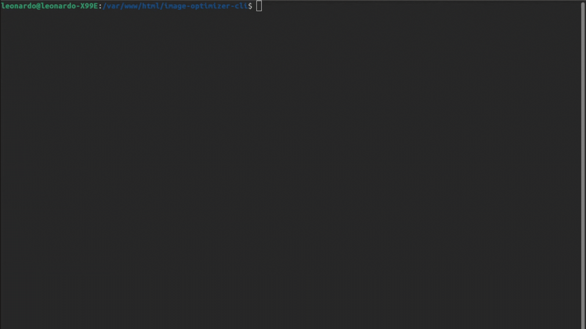

## 1. Automação de CI (GitHub Actions)

Este arquivo garantirá que qualquer contribuição futura ou alteração sua mantenha esse padrão de "Zero Erros" de tipagem.


## 🧑‍💻 Stack de desenvolvimento


> Ferramenta profissional de otimização de assets em paralelo, desenvolvida com tipagem estrita para máxima confiabilidade.



---

```yaml
# .github/workflows/ci.yml
name: CI - Type Checking

on:
  push:
    branches: [ main, master ]
  pull_request:
    branches: [ main, master ]

jobs:
  lint:
    runs-on: ubuntu-latest
    steps:
      - uses: actions/checkout@v4

      - name: Install uv
        uses: astral-sh/setup-uv@v3
        with:
          version: "latest"
          enable-cache: true

      - name: Set up Python
        run: uv python install 3.12

      - name: Install dependencies
        run: uv sync --all-extras --dev

      - name: Run Mypy
        run: uv run mypy --strict --explicit-package-bases src

```

---

## 2. README.md Profissional

Um repositório útil para outros devs precisa "vender" o problema que ele resolve. Como você foca em **Next.js/React**, o foco aqui é a performance de carregamento (LCP).


# ⚡ v0 Image Optimizer CLI

Uma ferramenta de linha de comando de alta performance para otimização em lote de assets visuais, projetada especificamente para fluxos de trabalho Web (Next.js, React, Laravel).

## 🚀 Por que usar?

Em projetos modernos, o **LCP (Largest Contentful Paint)** é crucial. Esta ferramenta automatiza a conversão e compressão de imagens utilizando **processamento paralelo**, garantindo que seus assets pesem o mínimo possível sem perda de qualidade perceptível.

## 🛠️ Diferenciais Técnicos

* **Multithreading Real:** Utiliza `ProcessPoolExecutor` para contornar o GIL do Python e usar todos os núcleos do seu processador (X99/Xeon/M1/M2).
* **Tipagem Estrita:** 100% validado com `mypy --strict` para garantir robustez e previsibilidade.
* **Modern Stack:** Gerenciado via `uv` (Rust-based python manager) para instalações instantâneas.
* **Relatórios Ricos:** Interface visual via terminal com `rich` e `typer`.

## 📦 Instalação

```bash
# Clone o projeto
git clone [https://github.com/LeonardoFirme/image-optimizer-cli.git](https://github.com/LeonardoFirme/image-optimizer-cli.git)
cd image-optimizer-cli

```

```bash
# Instale as dependências (requer uv instalado)
uv sync

```

## 💻 Como usar

```bash
uv run src/main.py --input ./public/assets/raw --output ./public/assets/optimized --format WEBP
```


### Argumentos:

* `-i, --input`: Diretório contendo JPG/PNG originais.
* `-o, --output`: Diretório de destino para os assets otimizados.
* `-f, --format`: Formato de saída (`WEBP`, `AVIF`, `PNG`, `JPEG`). Padrão: `WEBP`.

## 📊 Performance

Em nossos benchmarks, conseguimos reduções de até **80% no tamanho do arquivo** original, processando centenas de imagens em segundos graças à arquitetura paralela.

---

Desenvolvido por **Leonardo Firme** | [LeonardoFirme](https://github.com/LeonardoFirme)

---